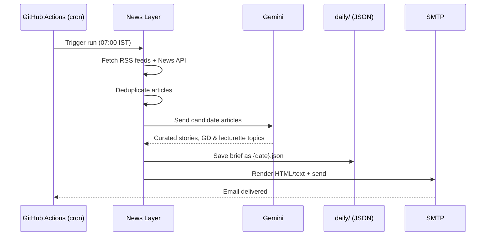
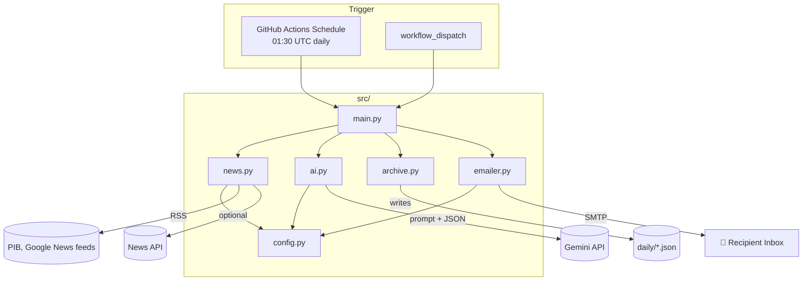

<div align="center">

# Daily News Brief

**An automated current-affairs briefing service for SSB aspirants — built with Python, Gemini, and GitHub Actions.**


</div>

---

| | |
|---|---|
| 📰 News Collection | Pulls defence, geopolitics, and policy news from RSS feeds and (optionally) News API |
| 🧹 Deduplication | Strips duplicate stories before they reach the LLM |
| 🤖 AI Curation | Gemini selects the 6–8 most SSB-relevant stories and writes structured summaries |
| 🎯 SSB-Oriented Output | Auto-generates SSB questions, GD topics, and lecturette topics for each briefing |
| 🗄️ Daily Archive | Every briefing is saved as JSON in `daily/` and committed back to the repo |
| 📧 Email Delivery | Sends a formatted HTML + plain-text email every morning |
| ⏰ Zero-Infra Scheduling | Runs entirely on GitHub Actions — no server to maintain |

---

## Pipeline



---

## Architecture



---

## Stack

| Layer          | Technology                          |
| -------------- | ------------------------------------ |
| Runtime        | Python 3.12                          |
| News ingestion | `feedparser`, `requests`, News API    |
| AI curation    | Google Gemini (`google-genai`)       |
| Scheduling     | GitHub Actions (cron + manual run)   |
| Delivery       | SMTP (`smtplib`, HTML + plain-text)  |
| Persistence    | JSON files committed to `daily/`     |

---

## How It Works

### 1. Collect

`news.py` pulls from a fixed set of RSS feeds — PIB, and curated Google News queries for defence, geopolitics, and national policy — plus News API if a key is configured. Titles are deduplicated before moving on.

### 2. Curate

`ai.py` sends the compact article list to Gemini with a system prompt tuned for SSB relevance: defence and national security first, then foreign relations, government policy, DRDO/ISRO/science, military affairs, and major economic/social issues. The model returns strict JSON — 6–8 stories, each with a summary, an SSB angle, key facts, and practice questions — plus GD topics, lecturette topics, and a quick-revision list.

### 3. Archive

`archive.py` writes the brief to `daily/{date}.json`. The GitHub Actions workflow commits this file back to the repository, building a searchable history of past briefings over time.

### 4. Deliver

`emailer.py` renders the brief as both HTML and plain text and sends it via SMTP.

---

## Sample Output Shape

```json
{
  "date": "YYYY-MM-DD",
  "stories": [
    {
      "category": "Defence",
      "title": "...",
      "summary": "...",
      "why_it_matters_for_ssb": "...",
      "key_facts": ["...", "..."],
      "ssb_questions": ["...", "..."],
      "source": "...",
      "url": "..."
    }
  ],
  "gd_topics": ["...", "..."],
  "lecturette_topics": ["...", "..."],
  "quick_revision": ["...", "...", "...", "...", "..."]
}
```

---

## Project Structure

```text
daily_news_brief/
│
├── src/
│   ├── config.py       # Env-driven settings
│   ├── news.py         # RSS + News API collection, dedup
│   ├── ai.py            # Gemini prompt + curation
│   ├── archive.py       # Saves daily/{date}.json
│   ├── emailer.py       # HTML + text rendering, SMTP send
│   └── main.py           # Orchestrates the pipeline
│
├── daily/                # Archived JSON briefings (auto-committed)
├── .github/
│   └── workflows/
│       └── daily_brief.yml
│
├── requirements.txt
├── .env.example
└── .gitignore
```

---

## Setup

### 1. Create a repository

Push this project to a new GitHub repository.

### 2. Configure secrets

Go to `Repository → Settings → Secrets and variables → Actions` and add:

| Secret | Required | Notes |
|---|---|---|
| `GEMINI_API_KEY` | ✅ | From Google AI Studio |
| `GEMINI_MODEL` | Optional | Defaults to `gemini-2.5-flash` |
| `NEWS_API_KEY` | Optional | Adds News API as a second source |
| `SMTP_HOST` | ✅ | e.g. `smtp.gmail.com` |
| `SMTP_PORT` | ✅ | e.g. `587` |
| `SMTP_USERNAME` | ✅ | Sending account |
| `SMTP_PASSWORD` | ✅ | Use an **App Password** for Gmail |
| `EMAIL_FROM` | ✅ | Sender address |
| `EMAIL_TO` | ✅ | Recipient address |

### 3. Run locally

```bash
python -m venv .venv
source .venv/bin/activate

pip install -r requirements.txt

cp .env.example .env
# fill in .env, then export or use a tool like `direnv` / `python-dotenv`

python -m src.main
```

### 4. Run on GitHub Actions

Push the repository, then trigger a manual run from `Actions → Daily News Brief → Run workflow`, or wait for the schedule.

The workflow runs daily at **07:00 IST**:

```yaml
- cron: "30 1 * * *"  # GitHub Actions schedules are always UTC
```

---

## Production Notes

**News quality** — RSS/News API are only the ingestion layer; the LLM is not a source of truth. For a stronger version, add primary sources (PIB, Ministry of Defence, MEA, DRDO, ISRO, the three services) and preserve the source URL for every generated claim.

**Cost control** — Keep the article batch small, send only the fields Gemini needs, and consider caching processed URLs to avoid reprocessing.

**Security** — Never commit API keys; everything is read from GitHub Actions Secrets / environment variables.

**Scaling** — v1 intentionally skips FastAPI, Redis, Celery, and Postgres. Add them only if you need user accounts, personalized briefings, a web dashboard, historical search, subscriptions, or multi-channel delivery.

---

## Roadmap

- [ ] Multiple recipient lists / per-user personalization
- [ ] Web dashboard for browsing past briefings
- [ ] Additional primary-source feeds (PIB, MoD, MEA, DRDO, ISRO)
- [ ] URL-level caching to cut duplicate LLM calls
- [ ] Telegram/WhatsApp delivery channel
- [ ] Weekly digest / revision mode

---

## License

MIT

---

<div align="center">

**Daily News Brief · Automated current-affairs briefing with Python, Gemini & GitHub Actions**

</div>
